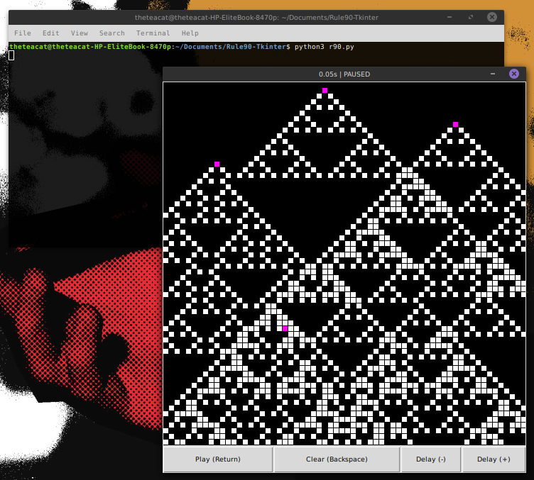

# rule90-tkinter

A simple ~200 line Python script I wrote in 2016 for visualising [rule 90](https://en.wikipedia.org/wiki/Rule_90).

I had another one that did Conway's game of life somewhere, but I can't find it at the moment. Maybe it'll appear here one day...


## Usage

```
python3 r90.py
```

A wild GUI appeared!

